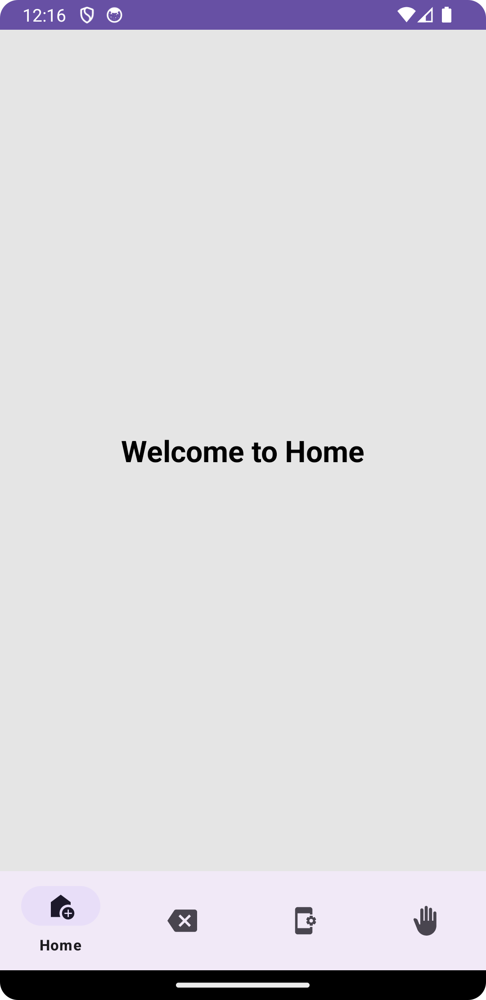
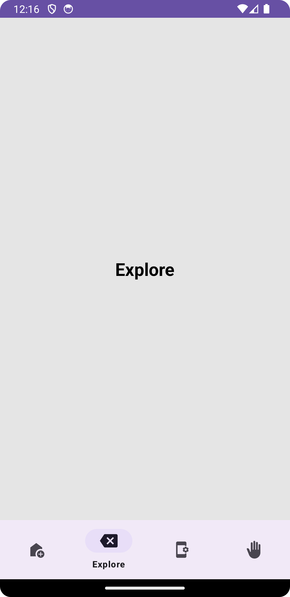
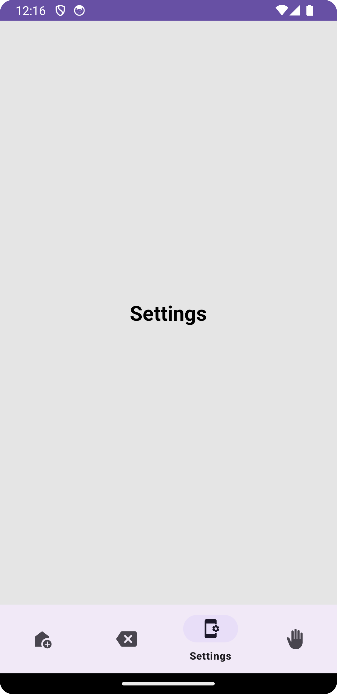

# Jetpack Bottom Navigation

A simple Android application demonstrating the implementation of Bottom Navigation using Jetpack components.

## Overview

This project showcases the integration of Bottom Navigation functionality in an Android app. It includes multiple fragments navigable via the Bottom Navigation menu, each representing a different section of the app.

## Features

- **Bottom Navigation:** Utilizes the `BottomNavigationView` component to enable seamless navigation between different sections of the app.
- **Fragments:** Demonstrates the use of fragments for displaying distinct UI sections for Home, Explore, Settings, and Profile.

## Technologies & Components Used

- Kotlin
- Android Studio
- Jetpack Navigation Component
- `BottomNavigationView`
- Fragments
- XML layouts

## Setup & Usage

- Clone this repository.
- Open the project in Android Studio.
- Run the app on an emulator or physical device.

## Screenshots

## Screenshots

## Contributing

Pull requests are welcome. For major changes, please open an issue first to discuss what you would like to change.

## License

[License information here]

## Acknowledgements

Mention any third-party libraries, assets, or resources used in the project.
